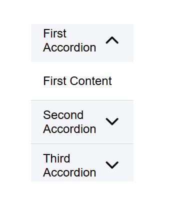
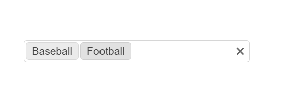
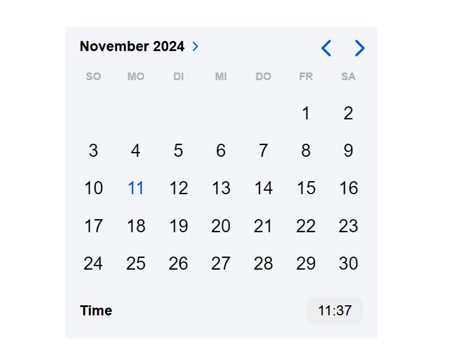

# Accordion
Eine Komponente, die es ermöglicht, Inhalte in einer hierarchischen Struktur anzuzeigen und aus- und einzuklappen.
Zweck: Sie dient dazu, die Benutzeroberfläche aufgeräumt zu halten und Informationen kompakt anzuzeigen, indem nur relevante Inhalte sichtbar gemacht werden, wenn der Benutzer darauf klickt.

# Multiselect
Ein UI-Element, das es Benutzern ermöglicht, mehrere Optionen aus einer Liste auszuwählen.
Zweck: Ermöglicht eine flexible Auswahl, bei der der Benutzer mehrere Elemente gleichzeitig auswählen kann, was besonders bei Filtern oder komplexen Formulareingaben hilfreich ist.

# Date Picker
Ein UI-Element, das es Benutzern ermöglicht, Datumsangaben auszuwählen, indem sie auf einen Kalender klicken.
Zweck: Reduziert Eingabefehler und vereinfacht die Eingabe von Datumsangaben, indem es eine visuelle und intuitive Methode zur Datumsauswahl bietet.

# Autocomplete
Eine Komponente, die Vorschläge basierend auf dem eingegebenen Text anzeigt und die Eingabe von Text erleichtert.
Zweck: Beschleunigt die Eingabe und reduziert Tippfehler, indem dem Benutzer mögliche Übereinstimmungen vorgeschlagen werden, was vor allem bei langen Listen oder komplexen Eingaben hilfreich ist.

# Slider
Ein UI-Element, das es Benutzern ermöglicht, Werte aus einem bestimmten Bereich auszuwählen, indem sie einen Regler bewegen.
Zweck: Bietet eine schnelle und präzise Auswahl von Werten innerhalb eines Bereichs, ideal für Einstellungen wie Lautstärke, Helligkeit oder Preisfilter.

# Progress Bar
Eine Komponente, die den Fortschritt einer Aktion anzeigt.
Zweck: Informiert den Benutzer über den Fortschritt einer laufenden Aufgabe und sorgt so für Transparenz und eine bessere Benutzererfahrung, indem der Status visuell angezeigt wird.

# Carousel/Slideshow
Eine Komponente, die es ermöglicht, Bilder oder andere Inhalte in einer Diashow anzuzeigen.
Zweck: Ermöglicht das effiziente Präsentieren mehrerer Inhalte auf begrenztem Raum, wie Bildergalerien oder Werbeinhalte, die der Benutzer durchblättern kann.

# Rating
Eine Komponente, die es Benutzern ermöglicht, eine Bewertung abzugeben, indem sie Sterne oder andere Symbole auswählen.
Zweck: Erleichtert die Bewertung und Rückmeldung zu Inhalten oder Produkten und gibt zukünftigen Benutzern Orientierung, indem aggregierte Bewertungen angezeigt werden können.

# Treeview
Eine Komponente, die es ermöglicht, hierarchische Strukturen anzuzeigen und zu navigieren.
Zweck: Bietet eine übersichtliche Darstellung von verschachtelten Datenstrukturen, z. B. Dateisysteme oder Kategoriebäume, und vereinfacht so die Navigation in komplexen Datenstrukturen.
